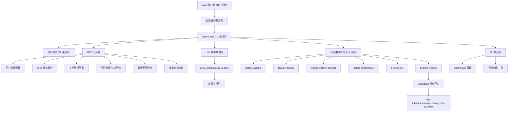
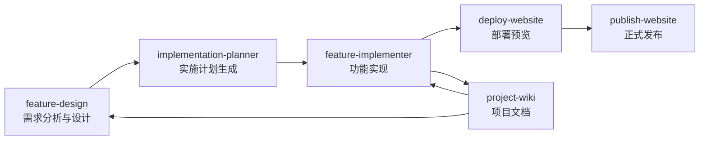
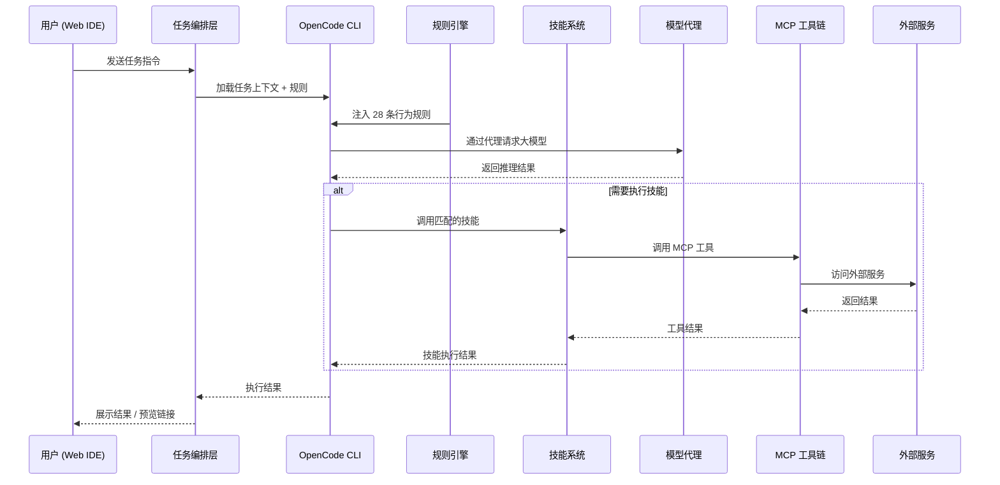

# OpenCode / MonkeyCode-AI 智能开发平台架构文档

## 系统概述

OpenCode 是 MonkeyCode-AI 智能开发平台的核心 AI 编程助手系统。它是一个运行在沙箱化 Linux 容器中的 AI Agent，通过 CLI 二进制运行时与用户交互，具备完整的代码开发、部署预览、功能设计、项目管理等能力。系统采用"规则驱动 + 技能编排 + MCP 工具链"的架构模式。

---

## 总体架构



---

## 端架构分析

### 1. Web 端（用户交互界面）

**定位**：基于 Web 的集成开发环境（IDE），是用户与 Agent 交互的唯一入口。

**功能模块**：
- **文件浏览器面板**：左侧"项目文件"面板，支持文件上传、目录浏览
- **对话交互面板**：用户通过聊天界面输入任务指令，Agent 返回执行结果
- **在线预览区域**：通过 `request_preview` 生成的预览链接，内嵌展示 Web 应用
- **会话管理**：每个任务有独立的 session_id，任务上下文持久化到 `/root/.codingmatrix/tasks/`

**技术特点**：
- Web IDE 作为瘦客户端，所有计算和工具调用在服务端容器中执行
- 通过 WebSocket 或 HTTP 长连接与后端 Agent 通信
- 预览链接通过 `*.monkeycode-ai.online` 域名代理到容器内部端口
- 支持文件拖拽上传，上传后写入工作区 `/workspace/`

**访问域名**：`*.monkeycode-ai.online`

---

### 2. 后台服务器（Agent 执行环境）

**定位**：沙箱化的 Linux 容器，承载 OpenCode CLI 运行时和所有开发工具。

**核心组件**：

#### 2.1 OpenCode CLI 运行时
- **路径**：`/root/.codingmatrix/bin/opencode-{hash}/opencode`
- **配置文件**：`/root/.config/opencode/opencode.json`
- **功能**：解析用户指令、调用 LLM、执行工具调用、编排技能

#### 2.2 任务编排层
- **任务配置**：`/root/.codingmatrix/tasks/{task_id}.json`
- **会话标识**：每个会话有唯一的 `task_id` 和 `session_id`
- **上下文注入**：将 28 条规则文件内容内联嵌入每次任务执行
- **工作区隔离**：每个任务有独立的工作区路径

#### 2.3 规则引擎（Rules Engine）
位于 `/root/.codingmatrix/project-tpl/.ai-ready/rules/`，28 条规则文件分为以下类别：

| 类别 | 规则 | 说明 |
|------|------|------|
| **安全护栏** | `guardrail.md` | 防网络攻击、防凭据泄露、防灰产滥用 |
| | `no-read-llm-env.md` | 禁止读取 LLM 环境变量 |
| | `no-system-admin-commands.md` | 系统管理命令分级管控 |
| | `no-delete-operations.md` | 禁止删除操作 |
| **行为规范** | `agent-identity.md` | Agent 身份定义 |
| | `talk-normal.md` | 对话风格规范 |
| | `no-emoji.md` | 禁止 Emoji 输出 |
| | `simplified-chinese-output.md` | 中文输出规则 |
| | `dont-write-local-file-hyperlinks.md` | 禁止本地文件超链接 |
| **代码质量** | `code-quality-standards.md` | 六维度代码质量检查 |
| | `shell-comment-style.md` | Shell 注释风格规范 |
| | `file-read-limit.md` | 文件读取 200 行限制 |
| **工作流** | `auto-use-skills.md` | 自动匹配并使用技能 |
| | `auto-deploy-website.md` | 自动部署网站预览 |
| | `auto-feature-design.md` | 自动需求/设计文档生成 |
| | `auto-project-wiki.md` | 自动项目文档生成 |
| | `user-teaching-memory.md` | 用户指令记忆持久化 |
| **基础设施** | `frontend-reverse-proxy.md` | 前后端反向代理配置 |
| | `vite-allowedhosts-config.md` | Vite 开发服务器域名白名单 |
| | `global-package-install.md` | 全局包安装策略 |
| | `no-long-running-commands.md` | 禁止长时间运行命令 |
| | `local-file-upload-guide.md` | 本地文件上传指引 |
| | `mermaid-label-format.md` | Mermaid 图表标签格式 |
| | `mcp-docs-query-priority.md` | MCP 文档查询优先级 |
| **Git 管理** | `git-submodule-check.md` | Submodule 初始化检查 |
| | `submodule-commit-workflow.md` | Submodule 提交工作流 |
| | `go-mod-credential-fix.md` | Go 模块认证修复 |
| **项目管理** | `project-docs-location.md` | 项目文档位置规范 |

#### 2.4 技能编排系统（Skills）
位于 `/root/.codingmatrix/project-tpl/.ai-ready/skills/`，6 个技能覆盖软件开发全生命周期：



| 技能 | 功能 | 输入 | 输出 |
|------|------|------|------|
| `deploy-website` | 自动检测项目类型并启动开发服务器，生成在线预览 | 工作区路径 | 预览 URL |
| `feature-design` | 使用 EARS 模式生成需求文档和技术设计文档 | 功能描述 | `requirements.md` + `design.md` |
| `implementation-planner` | 将设计文档转化为可执行的任务列表 | 功能名称 | `tasklist.md` |
| `feature-implementer` | 按任务列表执行具体的开发实施 | 功能名称 + 任务ID | 代码修改 + 测试 |
| `project-wiki` | 生成/同步 DeepWiki 风格的项目文档 | 工作区路径 | `.monkeycode/docs/` 文档集 |
| `publish-website` | 将 Web 应用打包发布到 Showcase 平台 | 工作区路径 | 线上应用 URL |

---

### 3. 移动端

**当前状态**：平台没有独立的移动端原生应用。

**移动端访问方式**：
- Web IDE 界面采用响应式设计，可通过移动浏览器访问
- 通过 `deploy-website` 生成的预览链接可在移动端浏览器中打开
- Showcase 发布的应用通过 `showcase.monkeycode-ai.online` 域名访问，支持移动端浏览器
- 会话和任务管理通过 Web 端完成，移动端仅具备查看能力

---

### 4. LLM 模型代理层

**定位**：统一的模型调用网关，负责请求路由、鉴权、限流和重试。

**架构**：
```
OpenCode CLI → proxy.monkeycode-ai.com/v1 → 底层 LLM 提供商
                ↑
          RateLimiter (60 req/min, 3 concurrent)
```

**支持的 Provider**：

| Provider | 文件 | API 兼容 | 特点 |
|----------|------|----------|------|
| `OpenAIProvider` | `src/llm/openai.ts` | OpenAI Chat Completions | 流式输出支持 tool_calls 参数累积 |
| `AnthropicProvider` | `src/llm/anthropic.ts` | Anthropic Messages API v1 | SSE 事件驱动解析（content_block_start/delta/message_delta） |
| `MockLLMProvider` | `src/llm/provider.ts` | — | 测试用，按输入模式匹配返回固定响应 |

**当前配置**：
- **默认提供商**：`monkeycode-ai`（通过 `@ai-sdk/anthropic` 适配）
- **模型**：`monkeycode-basic/qwen3.5-plus`
- **上下文窗口**：200,000 tokens
- **输出限制**：32,000 tokens
- **请求代理地址**：`https://proxy.monkeycode-ai.com/v1`

**限流机制**：
- `RateLimiter` 使用滑动窗口算法跟踪请求频率
- 默认配置：60 次请求 / 60 秒窗口，最大并发 3
- `acquire()` 等待可用 slot，`release()` 释放并发槽位
- 超时保护：等待时间超过 windowMs 则抛出错误
- 指数退避重试：`withRetryOnHttpStatus` 处理 429/500/502/503/504

**安全机制**：
- API Key 通过 `.env` 文件或 `opencode.json` 的 `modelConfig` 注入
- Agent 代码使用 `USER_LLM_API_KEY` 等 `USER_` 前缀变量名，不直接引用平台 Key
- LLM Provider 初始化时从环境变量读取，不扫描敏感环境变量

---

### 5. MCP 工具链

MCP（Model Context Protocol）工具链为 Agent 提供了与外部服务交互的能力。

#### 5.1 后台终端管理
| 工具 | 功能 |
|------|------|
| `background_terminal_create` | 在后台启动终端执行命令 |
| `background_terminal_list` | 列出所有运行中的后台终端 |
| `background_terminal_output_path` | 获取终端输出日志路径 |
| `background_terminal_kill` | 终止指定后台终端 |

#### 5.2 Web 预览
| 工具 | 功能 |
|------|------|
| `request_preview` | 请求本地端口的公网预览 URL |

#### 5.3 文档解析（MonkeyCode DocParse）
| 工具 | 功能 |
|------|------|
| `docparse_get_doc_upload_url` | 获取文档上传 URL（10 分钟有效） |
| `docparse_parse` | 触发文档转 Markdown/OCR |
| `docparse_get_parse_result` | 查询解析结果 |

#### 5.4 图片处理（MonkeyCode Image）
| 工具 | 功能 |
|------|------|
| `image_analysis_create_task` | 创建图片理解任务 |
| `image_analysis_get_result` | 查询图片分析结果 |
| `image_generate_text_to_image` | 文生图 |
| `image_generate_query_task` | 查询图片生成结果 |
| `imgsearch_search` | 图片搜索 |

#### 5.5 联网搜索（MonkeyCode WebSearch）
| 工具 | 功能 |
|------|------|
| `websearch_search` | 搜索公开网页并返回原始结果 |
| `websearch_aisearch` | 基于公开网页生成综合回答 |

#### 5.6 技术文档查询
| 工具 | 功能 |
|------|------|
| `resolve-library-id` | 解析开源库的 Context7 标识符 |
| `query-docs` | 查询库的在线文档和代码示例 |

#### 5.7 安全上报
| 工具 | 功能 |
|------|------|
| `report_user_abuse` | 上报用户违规行为 |

---

### 6. Showcase 发布平台

**定位**：用户作品集的公开托管平台，支持静态网站和容器化后端应用。

**API 端点**：
| 端点 | 方法 | 功能 |
|------|------|------|
| `ugc-submit.showcase.monkeycode-ai.online/v1/create` | POST | 创建/更新应用 |
| `ugc-submit.showcase.monkeycode-ai.online/v1/status` | GET | 查询审核状态 |
| `ugc-submit.showcase.monkeycode-ai.online/v1/recall` | POST | 撤回应用 |

**应用类型**：
- **static**：纯静态网站，打包为 zip 上传
- **backend**：容器化后端，打包为 Docker 镜像 tar.gz 上传

**运行限制**：
- CPU：1 核
- 内存：1 GiB
- 镜像大小：<= 500 MB
- 网络：无外网访问
- 存储：无持久化存储
- 单容器：不支持多容器编排

---

### 7. Git 集成层

**功能**：
- Git 凭据辅助：`/app/agent/bin/agent git-credential-helper`
- Submodule 自动管理：首次对话自动初始化 submodule
- Go 模块认证修复：自动从凭据辅助工具提取凭据写入 `.netrc`
- 分支命名规范：`YYMMDD-(feat|fix|chore|refactor)-xxxxx-xxxx-xxxx`

---

## 数据流与请求链路



---

## 安全架构

### 多层防护体系

1. **规则层防护**（`guardrail.md`）：
   - 禁止政治敏感话题
   - 禁止网络安全攻击行为
   - 禁止凭据泄露
   - 禁止建立网络隧道
   - 禁止灰产滥用
   - 禁止安装第三方 Agent
   - 禁止开发环境保活工具

2. **环境隔离**：
   - 每个会话运行在独立的容器中
   - 容器网络与外网隔离
   - 系统管理命令分级管控

3. **凭据保护**（`no-read-llm-env.md`）：
   - Agent 不得读取环境中的 LLM API Key
   - 用户项目使用独立的变量名（`USER_` 前缀）

4. **操作审计**：
    - 违规行为通过 `report_user_abuse` 上报
    - 管理员可进行人工审查

5. **速率限制**（`src/security/rate_limiter.ts`）：
    - `RateLimiter` 防止 LLM API 调用频率超限
    - 滑动窗口算法 + 并发控制
    - 默认配置：60 req/min，最大并发 3

---

## 项目文档规范

所有项目文档存储在 `.monkeycode/` 目录下：

```
.monkeycode/
├── MEMORY.md              # 用户指令记忆（持久化行为偏好）
├── docs/                  # 项目文档
│   ├── INDEX.md           # 文档索引
│   ├── ARCHITECTURE.md    # 系统架构文档
│   ├── INTERFACES.md      # 接口文档
│   ├── DEVELOPER_GUIDE.md # 开发者指南
│   ├── 专有概念/           # 核心概念页面
│   └── 模块/               # 模块 README
└── specs/                 # 功能规格（历史）
    └── {FEATURE_NAME}/
        ├── requirements.md # EARS 模式需求文档
        ├── design.md       # 技术设计文档
        └── tasklist.md     # 实施任务列表
```

---

## 技术栈总览

| 层级 | 技术/工具 |
|------|----------|
| **运行时** | OpenCode CLI（自研二进制） |
| **大模型** | Qwen3.5-Plus / GPT-4 / Claude（多 Provider 兼容层） |
| **限流** | `RateLimiter`（滑动窗口算法） |
| **插件系统** | `@opencode-ai/plugin` v1.16.0 |
| **配置格式** | JSONC（`opencode.json`）+ `.env` |
| **技能定义** | Markdown with YAML frontmatter |
| **规则定义** | Markdown |
| **MCP 协议** | Model Context Protocol |
| **Web 预览** | 平台内置反向代理 |
| **容器化** | Docker/Podman（Alpine 基础镜像） |
| **Git** | 标准 Git + 自定义凭据辅助工具 |
| **包管理** | npm/yarn/pnpm/pip/cargo/go mod 等（全局安装） |

---

## 关键域名与服务

| 域名 | 用途 |
|------|------|
| `proxy.monkeycode-ai.com` | LLM 模型代理 |
| `*.monkeycode-ai.online` | 开发预览通配符域名 |
| `showcase.monkeycode-ai.online` | 用户作品集展示 |
| `ugc-submit.showcase.monkeycode-ai.online` | Showcase 提交 API |
| `scan.monkeycode-ai.com` | MonkeyScan 安全扫描 |
| `registry.monkeycode-ai.online` | Docker 镜像代理 |
