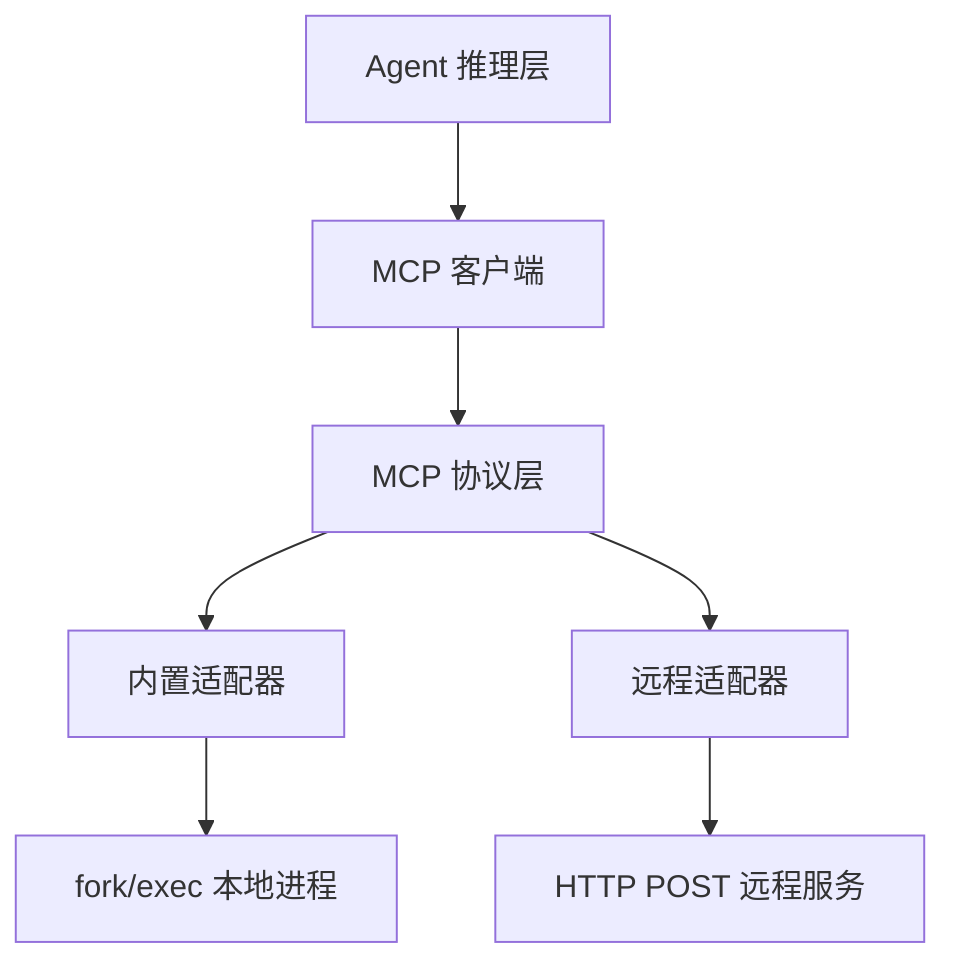

# MCP 协议

MCP（Model Context Protocol）是 OpenCode 与外部服务交互的标准化协议。

## 协议层次



## 工具调用流程

1. Agent 在推理过程中决定调用某工具
2. LLM 返回 `tool_use` 内容块
3. MCPDispatcher 将调用分发到对应适配器
4. 适配器执行并返回结果
5. 结果作为 `tool_result` 注入下一轮推理

## 工具命名规范

```
{namespace}__{tool_name}

示例：
  mcaiBuiltin_background_terminal_create
  monkeycode-ai_MonkeyCode__websearch_search
  monkeycode-ai_internal__report_user_abuse
```

## 内置 vs 远程

| 特性 | 内置适配器 | 远程适配器 |
|------|----------|----------|
| 执行方式 | 本地进程 fork | HTTP API |
| 延迟 | 低 | 中 |
| 资源隔离 | 不隔离 | 完全隔离 |
| 可用性 | 始终可用 | 依赖网络 |
| 典型工具 | terminal、preview | docparse、websearch |

## 参数传递

所有工具参数通过 JSON 对象传递，遵循以下规范：
- 参数名使用 snake_case
- 必填参数通过 `required` 数组声明
- 数字参数有范围校验
- 字符串参数有空值校验
