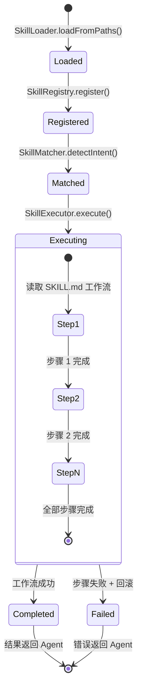

# 技能生命周期

每个技能从加载到执行完成经历以下阶段：

## 各阶段说明

### Loaded（已加载）
- `SkillLoader` 从文件系统读取 `SKILL.md`
- 解析 YAML frontmatter（name、description、arguments）
- 提取 Markdown 正文作为工作流指令
- 验证 `name` 和 `description` 必填字段

### Registered（已注册）
- 加入 `SkillRegistry.skills` Map
- 按 name 索引，支持快速查找
- `MatchRule` 注册匹配规则

### Matched（已匹配）
- 用户输入与技能规则匹配
- 计算匹配置信度分数
- 置信度 > 阈值 → 自动调用
- 多个匹配 → 选择最高分

### Executing（执行中）
- 按 SKILL.md 中的编号步骤执行
- 每个步骤可调用 MCP 工具
- 步骤间通过文件系统传递中间产物
- 失败时执行回滚逻辑

### Completed（已完成）
- 所有步骤成功执行
- 产物写入指定位置
- 结果回传给 Agent 推理循环

### Failed（已失败）
- 某个步骤执行失败
- 执行回滚逻辑（清理中间文件）
- 错误信息回传给 Agent
