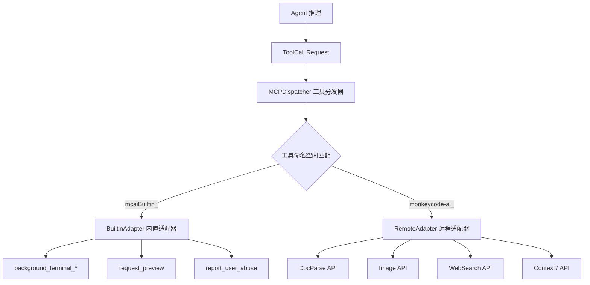

# MCP 工具链模块设计

## 概述

MCP（Model Context Protocol）工具链是 OpenCode 与外部服务交互的唯一通道。通过统一的工具调用协议，Agent 可访问后台终端管理、Web 预览、文档解析、图片处理、联网搜索等服务。

## 架构



## 组件设计

### 2.1 MCPDispatcher (工具分发器)

**职责**：根据工具名前缀将调用分发到对应适配器。

```typescript
class MCPDispatcher {
  private adapters: Map<string, ToolAdapter> = new Map();
  
  registerAdapter(namespace: string, adapter: ToolAdapter): void;
  
  async dispatch(call: ToolCall): Promise<ToolResult> {
    const namespace = this.extractNamespace(call.tool_name);
    const adapter = this.adapters.get(namespace);
    if (!adapter) throw new ToolError('TOOL_NOT_FOUND', call.tool_name);
    return adapter.execute(call);
  }
  
  async dispatchBatch(calls: ToolCall[]): Promise<ToolResult[]>;
}
```

**命名空间映射**：

| 前缀 | 适配器类型 | 说明 |
|------|----------|------|
| `mcaiBuiltin_*` | BuiltinAdapter | 内置工具（终端管理、预览、上报） |
| `monkeycode-ai_MonkeyCode__*` | RemoteAdapter | 远程服务（文档、图片、搜索） |
| `monkeycode-ai_internal__*` | BuiltinAdapter | 内部工具（上报） |

### 2.2 ToolAdapter (工具适配器接口)

```typescript
interface ToolAdapter {
  namespace: string;
  
  // 列出所有可用工具定义
  listTools(): ToolDefinition[];
  
  // 执行工具调用
  execute(call: ToolCall): Promise<ToolResult>;
  
  // 验证参数
  validate(call: ToolCall): ValidationResult;
}

interface ToolDefinition {
  name: string;
  description: string;
  parameters: ParameterSchema;
  handler: (params: Record<string, unknown>) => Promise<unknown>;
}

interface ParameterSchema {
  type: string;
  properties: Record<string, PropertySchema>;
  required: string[];
}
```

### 2.3 BuiltinAdapter (内置适配器)

**职责**：处理本地可执行的工具调用。

```typescript
class BuiltinAdapter implements ToolAdapter {
  namespace = "mcaiBuiltin";
  
  constructor(
    private terminalManager: TerminalManager,
    private previewManager: PreviewManager,
    private abuseReporter: AbuseReporter
  ) {}
  
  listTools(): ToolDefinition[] {
    return [
      // background_terminal_create
      // background_terminal_list
      // background_terminal_output_path
      // background_terminal_kill
      // request_preview
    ];
  }
}
```

**后台终端管理流程**：
1. `background_terminal_create` → fork 子进程 → 重定向 stdout/stderr 到日志文件 → 返回 terminal_id
2. `background_terminal_list` → 扫描进程表 → 返回状态列表
3. `background_terminal_output_path` → 返回 `/tmp/opencode/terminal_{id}.log`
4. `background_terminal_kill` → 发送 SIGTERM → 超时 5s 后 SIGKILL

### 2.4 RemoteAdapter (远程适配器)

**职责**：通过 HTTP 调用外部 MCP 服务。

```typescript
class RemoteAdapter implements ToolAdapter {
  namespace = "monkeycode-ai_MonkeyCode";
  
  constructor(
    private baseURL: string,
    private httpClient: HttpClient,
    private rateLimiter: RateLimiter
  ) {}
  
  async execute(call: ToolCall): Promise<ToolResult> {
    // 1. 速率限制检查
    // 2. HTTP POST 到远程端点
    // 3. 解析响应
    // 4. 错误处理
  }
}
```

**远程服务端点**：

| 工具组 | 端点 |
|--------|------|
| DocParse | `https://docparse.monkeycode-ai.online/v1/` |
| Image Analysis/Generate | `https://image.monkeycode-ai.online/v1/` |
| WebSearch | `https://search.monkeycode-ai.online/v1/` |
| Context7 Docs | `https://context7.com/api/` |

### 2.5 RateLimiter (速率限制器)

```typescript
class RateLimiter {
  private limits: Map<string, RateLimit> = new Map();
  
  // 检查是否允许调用
  async checkLimit(toolName: string): Promise<boolean>;
  
  // 等待直到可用
  async waitUntilAvailable(toolName: string): Promise<void>;
  
  // 记录一次调用
  recordCall(toolName: string): void;
}

interface RateLimit {
  maxCallsPerMinute: number;
  windowMs: number;
  calls: number[];
}
```

## 错误处理策略

```typescript
class ToolErrorHandler {
  async handle(error: Error, call: ToolCall): Promise<ToolResult> {
    if (error instanceof NetworkError) {
      // 网络错误：重试 1 次
      return this.retry(call);
    }
    if (error instanceof TimeoutError) {
      // 超时：增加超时时间重试 1 次
      return this.retryWithTimeout(call, 60000);
    }
    if (error instanceof RateLimitError) {
      // 限流：退避等待后重试
      await this.backoff(error.retryAfter);
      return this.retry(call);
    }
    // 其他错误：直接返回失败
    return { success: false, error: error.message };
  }
}
```

## 测试策略

| 测试类型 | 覆盖内容 |
|---------|---------|
| 单元测试 | Dispatcher 分发逻辑、RateLimiter 限流算法、参数验证 |
| 集成测试 | Builtin 工具端到端（需要真实 fork）、Remote 工具 mock HTTP |
| 契约测试 | 与外部服务的请求/响应格式一致性 |
| 性能测试 | 限流器性能、批量调用并发 |
