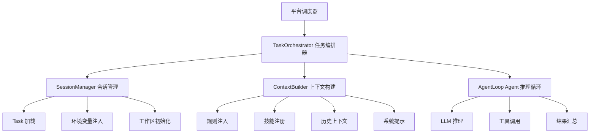

# 任务编排模块设计

## 概述

任务编排模块负责管理会话生命周期、注入上下文、协调 Agent 推理循环，是 OpenCode 运行时的"大脑"。

## 架构



## 组件设计

### 2.1 TaskOrchestrator (任务编排器)

**职责**：平台入口，接收任务配置，初始化环境，启动 Agent 循环。

```typescript
class TaskOrchestrator {
  constructor(
    private sessionManager: SessionManager,
    private contextBuilder: ContextBuilder,
    private agentLoop: AgentLoop
  ) {}
  
  async startTask(taskConfig: TaskConfig): Promise<void> {
    // 1. 创建会话
    const session = await this.sessionManager.create(taskConfig);
    
    // 2. 初始化工作区
    await this.initializeWorkspace(taskConfig.workspace);
    
    // 3. 构建初始上下文
    const context = await this.contextBuilder.build(session, taskConfig);
    
    // 4. 启动 Agent 推理循环
    await this.agentLoop.run(context);
  }
  
  private async initializeWorkspace(workspace: string): Promise<void>;
}
```

**启动时序**：
1. 平台调度器分配容器 → 注入 task_config.json
2. OpenCode CLI 启动 → 读取 task_config.json
3. TaskOrchestrator.startTask() 启动
4. 加载 submodule（如有 `.gitmodules`）
5. 注入 28 条规则到上下文
6. 加载 6 个技能
7. 进入 Agent 推理循环

### 2.2 SessionManager (会话管理)

**职责**：管理会话生命周期、状态持久化、环境变量。

```typescript
class SessionManager {
  private sessions: Map<string, Session> = new Map();
  private currentSession: Session | null = null;
  
  create(taskConfig: TaskConfig): Session;
  get(sessionId: string): Session | undefined;
  updateStatus(sessionId: string, status: SessionStatus): void;
  terminate(sessionId: string): void;
  
  // 设置会话环境变量
  injectEnv(env: Record<string, string>): void;
  
  // 子模块管理
  async initSubmodules(workspace: string): Promise<void>;
}
```

**会话状态转换**：

```
active ←→ idle
  ↓
terminated
```

- `active`：Agent 正在处理用户请求
- `idle`：等待用户输入
- `terminated`：会话结束（容器回收）

### 2.3 ContextBuilder (上下文构建)

**职责**：将规则、技能、历史等组装为 LLM 可用的上下文。

```typescript
class ContextBuilder {
  constructor(
    private ruleEngine: RuleEngine,
    private skillRegistry: SkillRegistry,
    private memoryLoader: MemoryLoader
  ) {}
  
  async build(session: Session, taskConfig: TaskConfig): Promise<AgentContext> {
    return {
      system_prompt: this.buildSystemPrompt(taskConfig),
      rules: this.ruleEngine.getInjectedRules(),
      skills: this.skillRegistry.list(),
      memory: await this.memoryLoader.load(session.workspace),
      history: [],
      tools: this.buildToolDefinitions(),
    };
  }
  
  private buildSystemPrompt(taskConfig: TaskConfig): string;
  private buildToolDefinitions(): ToolDefinition[];
}
```

**上下文 token 预算分配**（总计 200K）：

| 组成部分 | 分配 | 说明 |
|---------|------|------|
| System Prompt | ~5K | Agent 身份和行为指令 |
| Rules（28 条） | ~30K | 行为规则全文 |
| Skills 列表 | ~2K | 技能名和描述 |
| 工具定义 | ~5K | 所有 MCP 工具签名 |
| 用户输入 + 历史 | ~100K | 对话历史和当前请求 |
| 缓冲区 | ~58K | 工具调用结果、临时数据 |

### 2.4 AgentLoop (Agent 推理循环)

**职责**：核心的"推理-行动-观察"循环，Agent 存在的本质。

```typescript
class AgentLoop {
  constructor(
    private llmProvider: LLMProvider,
    private mcpDispatcher: MCPDispatcher,
    private guardrail: Guardrail
  ) {}
  
  async run(context: AgentContext): Promise<AgentResponse> {
    let thinking = true;
    let maxIterations = 50; // 安全上限
    
    while (thinking && maxIterations-- > 0) {
      // 1. 安全护栏检查
      await this.guardrail.check(context.lastUserInput);
      
      // 2. LLM 推理
      const response = await this.llmProvider.chat(context.messages);
      
      // 3. 判断是否需要工具调用
      if (response.tool_calls.length > 0) {
        // 4. 并行执行工具调用
        const results = await this.mcpDispatcher.dispatchBatch(response.tool_calls);
        
        // 5. 将结果追加到上下文
        context.appendToolResults(results);
      } else {
        thinking = false;
        return response;
      }
    }
    
    throw new Error('Max iterations exceeded');
  }
}
```

**推理循环流程**：

```
用户输入 → 护栏检查 → LLM 推理 → 工具调用？
    ↑                                    │
    └────────── 结果反馈 ←───────────────┘ （是）
                                            │
                                        文本回复（否）
```

## 测试策略

| 测试类型 | 覆盖内容 |
|---------|---------|
| 单元测试 | SessionManager 状态转换、ContextBuilder token 估算 |
| 集成测试 | 完整推理循环（mock LLM）、上下文构建正确性 |
| 边界测试 | 最大迭代次数、空输入、超长历史 |
