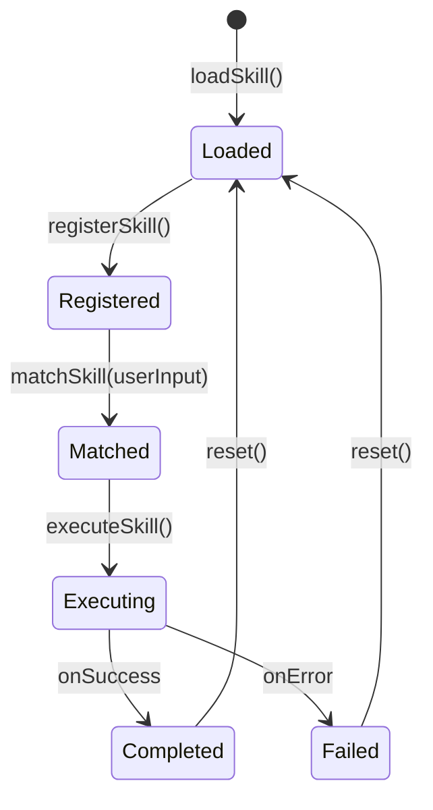

# 技能编排系统模块设计

## 概述

技能系统负责加载、注册、匹配和执行 6 个预定义技能。每个技能是一个独立的 Markdown 文档，包含 YAML frontmatter 元数据和工作流指令。

## 技能生命周期



## 组件设计

### 2.1 SkillRegistry (技能注册表)

**职责**：维护技能注册信息，提供查询和匹配能力。

```typescript
class SkillRegistry {
  private skills: Map<string, Skill> = new Map();
  
  register(skill: Skill): void;
  unregister(name: string): void;
  get(name: string): Skill | undefined;
  
  // 根据用户输入匹配最合适的技能
  matchBest(query: string): Skill | null;
  
  list(): Skill[];
  has(name: string): boolean;
}
```

**匹配策略**（优先级递减）：
1. 用户输入中包含技能名 → 精确匹配
2. 用户输入关键词命中技能 description → 语义匹配
3. 检测用户工作流状态自动推断 → 上下文匹配
4. 无匹配 → 返回 null，走常规开发流程

### 2.2 SkillLoader (技能加载器)

**职责**：从文件系统加载 SKILL.md 文件。

```typescript
class SkillLoader {
  constructor(private registry: SkillRegistry) {}
  
  async loadFromPaths(paths: string[]): Promise<void>;
  async loadSingle(skillDir: string): Promise<Skill>;
  
  // 解析 YAML frontmatter
  private parseFrontmatter(content: string): SkillMetadata;
  
  // 提取 Markdown 正文（工作流指令）
  private extractInstructions(content: string): string;
}
```

**加载流程**：
1. 遍历 skill paths，发现所有包含 `SKILL.md` 的目录
2. 读取 `SKILL.md`，分离 YAML frontmatter 和 Markdown 正文
3. 读取 `.agent-resource-version` 获取版本
4. 创建 Skill 对象并注册

### 2.3 SkillExecutor (技能执行器)

**职责**：根据 SKILL.md 中的工作流指令执行技能。

```typescript
class SkillExecutor {
  constructor(
    private registry: SkillRegistry,
    private mcpClient: MCPClient,
    private logger: Logger
  ) {}
  
  // 执行技能的完整工作流
  async execute(
    skillName: string, 
    args: Record<string, unknown>,
    context: ExecutionContext
  ): Promise<SkillResult>;
  
  // 执行单个步骤
  private async executeStep(
    step: WorkflowStep, 
    context: ExecutionContext
  ): Promise<StepResult>;
  
  // 错误回滚
  private async rollback(completedSteps: StepResult[]): Promise<void>;
}
```

### 2.4 SkillMatcher (技能匹配器)

**职责**：根据用户意图自动匹配技能。

```typescript
class SkillMatcher {
  // 匹配规则映射
  private matchRules: MatchRule[];
  
  // 检测用户意图并返回匹配技能
  detectIntent(userInput: string): SkillMatch[];

  // 计算匹配置信度
  private computeConfidence(skill: Skill, input: string): number;
}
```

**自动匹配规则示例**：

| 用户输入特征 | 匹配技能 |
|-------------|---------|
| "部署" "预览" "启动" "dev" | deploy-website |
| "新功能" "需求" "设计" | feature-design |
| "任务列表" "实施计划" | implementation-planner |
| "实现" "开发" "写代码" | feature-implementer |
| "文档" "wiki" "生成文档" | project-wiki |
| "发布" "publish" "上线" + 明确要求 publish-website | publish-website |

## 技能间协作

技能通过 `.monkeycode/specs/{FEATURE_NAME}/` 目录传递产物：

```
feature-design      → 生成 requirements.md + design.md
implementation-planner  → 读取 design.md → 生成 tasklist.md
feature-implementer → 读取 design.md + tasklist.md → 执行开发
project-wiki        → 读取所有代码 → 更新 docs/
```

## 技能开发规范

### YAML Frontmatter 规范

```yaml
---
name: skill-name           # 必填：kebab-case
description: 技能用途       # 必填：一句话描述
arguments:                  # 可选：入参定义
  - name: arg_name
    description: 参数说明
    required: false
---
```

### 工作流指令规范

- 使用编号步骤描述工作流
- 每个步骤必须可执行、可验证
- 错误处理需独立描述
- 引用 MCP 工具时使用完整工具名
- 禁止在指令中包含秘密信息

## 测试策略

| 测试类型 | 覆盖内容 |
|---------|---------|
| 单元测试 | SkillLoader 解析、SkillRegistry 注册/查询、SkillMatcher 匹配逻辑 |
| 集成测试 | SkillExecutor 执行完整工作流、技能间产物传递 |
| 夹具测试 | 使用 fixtures/ 中的示例 SKILL.md 验证加载 |
