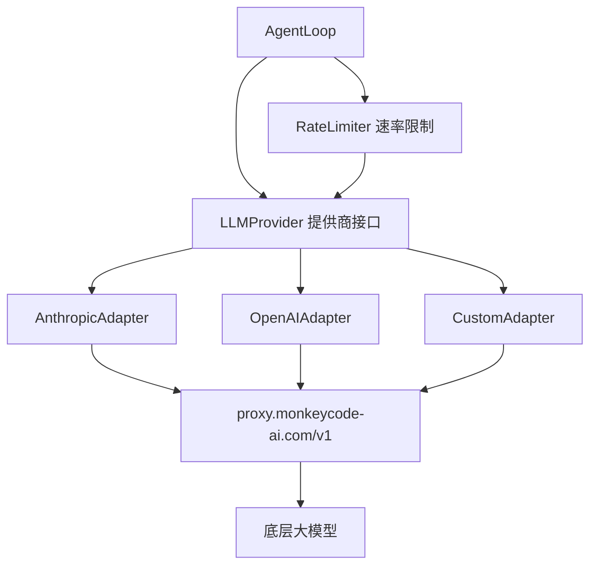

# LLM 模型代理层模块设计

## 概述

LLM 模型代理层是 Agent 与大语言模型之间的适配层，负责提供商抽象、请求路由、流式响应处理和速率限制。

## 架构



## 组件设计

### 2.1 LLMProvider (提供商接口)

```typescript
interface LLMProvider {
  name: string;
  
  // 单次对话
  chat(messages: Message[], options?: ChatOptions): Promise<ChatResponse>;
  
  // 流式对话
  chatStream(messages: Message[], options?: ChatOptions): AsyncIterable<ChatChunk>;
  
  // 列出可用模型
  listModels(): Promise<ModelInfo[]>;
  
  // 估算 token 数
  countTokens(text: string): number;
}

interface Message {
  role: "system" | "user" | "assistant" | "tool";
  content: string | ContentBlock[];
  tool_call_id?: string;
}

type ContentBlock = TextBlock | ImageBlock | ToolUseBlock | ToolResultBlock;

interface ChatOptions {
  model?: string;
  temperature?: number;
  max_tokens?: number;
  tools?: ToolDefinition[];
  stop_sequences?: string[];
}

interface ChatResponse {
  id: string;
  content: ContentBlock[];
  tool_calls: ToolCall[];
  usage: TokenUsage;
  finish_reason: "stop" | "tool_use" | "length" | "error";
}

interface TokenUsage {
  input_tokens: number;
  output_tokens: number;
  cache_creation_input_tokens?: number;
  cache_read_input_tokens?: number;
}
```

### 2.2 ConfigBasedProvider (配置驱动加载)

**职责**：从 `opencode.json` 动态加载提供商配置。

```typescript
class ConfigBasedProvider implements LLMProvider {
  name: string;
  
  constructor(config: LLMProviderConfig) {
    this.name = config.name;
    // 根据 config.npm 动态导入 SDK
    // 使用 config.options.baseURL 初始化客户端
    // 注册 config.models 中定义的模型
  }
  
  async chat(messages: Message[], options?: ChatOptions): Promise<ChatResponse> {
    // 如果指定了 model 不在注册列表中，使用默认模型
    const model = options?.model || this.defaultModel;
    
    // 检查 token 限制
    this.validateLimits(messages, model);
    
    // 调用 SDK
    return this.client.messages.create({
      model,
      messages,
      max_tokens: options?.max_tokens,
      tools: options?.tools,
      ...this.clientOptions
    });
  }
}
```

### 2.3 ModelConfig (模型配置)

```typescript
interface LLMProviderConfig {
  npm: string;             // SDK 包名，如 "@ai-sdk/anthropic"
  name: string;            // 配置名称
  options: {
    baseURL: string;       // API 端点
    apiKey?: string;       // 从环境变量读取
    headers?: Record<string, string>;
  };
  models: Record<string, {
    limit: {
      context: number;     // 上下文窗口
      output: number;      // 最大输出
    };
    options?: Record<string, unknown>; // 模型特定选项
  }>;
}
```

### 2.4 ProviderFactory (提供商工厂)

```typescript
class ProviderFactory {
  private providers: Map<string, LLMProvider> = new Map();
  private disabledProviders: Set<string> = new Set();
  
  constructor(config: OpenCodeConfig) {
    for (const [name, providerConfig] of Object.entries(config.provider)) {
      if (config.disabled_providers.includes(name)) continue;
      const provider = this.createProvider(providerConfig);
      this.providers.set(name, provider);
    }
  }
  
  private createProvider(config: LLMProviderConfig): LLMProvider {
    // 动态导入 SDK: await import(config.npm)
    return new ConfigBasedProvider(config);
  }
  
  getDefault(): LLMProvider {
    // 返回第一个可用的提供商
  }
  
  getByName(name: string): LLMProvider | undefined;
}
```

### 2.5 RateLimiter (速率限制)

```typescript
class LLMRateLimiter {
  private limits: Map<string, {
    requestsPerMinute: number;
    tokensPerMinute: number;
    tokensPerDay: number;
  }> = new Map();
  
  async checkLimit(model: string, estimatedTokens: number): Promise<void> {
    // 检查分钟级请求限制
    // 检查分钟级 token 限制
    // 检查日级 token 限制
    // 超限时抛出 RateLimitError 并携带 retryAfter
  }
  
  recordUsage(model: string, usage: TokenUsage): void;
}
```

### 2.6 StreamHandler (流式处理)

```typescript
class StreamHandler {
  // 处理流式响应
  async processStream(
    stream: AsyncIterable<ChatChunk>,
    onToken: (token: string) => void,
    onToolCall: (toolCall: Partial<ToolCall>) => void,
    onComplete: (response: ChatResponse) => void
  ): Promise<void>;
  
  // 累积流式内容
  private accumulateContent(chunks: ChatChunk[]): ContentBlock[];
  
  // 累积工具调用
  private accumulateToolCalls(chunks: ChatChunk[]): ToolCall[];
}

interface ChatChunk {
  type: "content_block_start" | "content_block_delta" | "content_block_stop" | "message_delta";
  index: number;
  delta?: {
    type: "text_delta" | "input_json_delta";
    text?: string;
    partial_json?: string;
  };
  content_block?: ContentBlock;
  usage?: TokenUsage;
}
```

## 安全考虑

- API Key 从环境变量读取，代码中不硬编码
- 所有请求通过平台代理，进行审计和限流
- 请求日志不记录消息内容（保护用户隐私）
- 禁用列表中的提供商不加载

## 测试策略

| 测试类型 | 覆盖内容 |
|---------|---------|
| 单元测试 | ProviderFactory 创建逻辑、RateLimiter 限流算法 |
| Mock 测试 | Mock HTTP 请求验证 SDK 调用参数正确性 |
| 集成测试 | 真实 API 调用（需要有效的测试 Key） |
