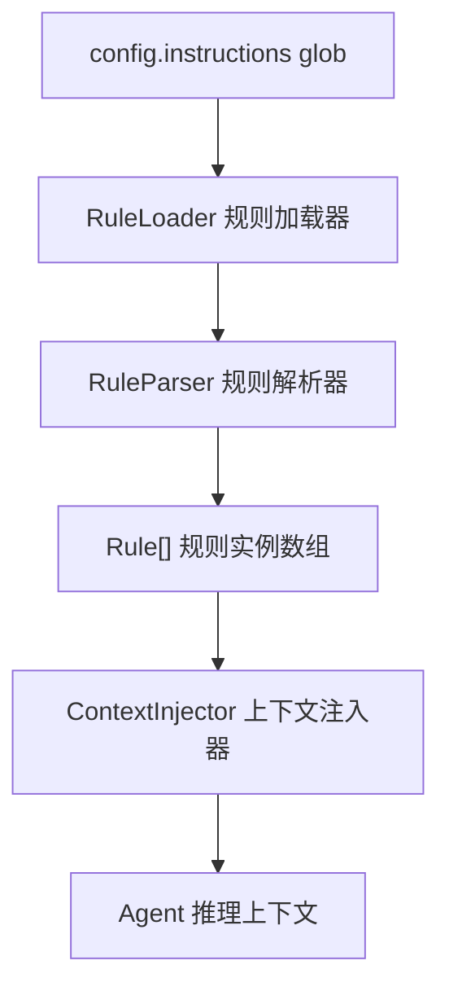

# 规则引擎模块设计

## 概述

规则引擎是 OpenCode 的行为约束层，在每次 Agent 推理前将 28 条 Markdown 规则注入上下文，确保 Agent 行为符合平台安全和规范要求。

## 架构



## 组件设计

### 2.1 RuleLoader (规则加载器)

**职责**：从文件系统加载规则文件。

```typescript
class RuleLoader {
  constructor(private basePath: string) {}
  
  // 根据 glob 模式加载所有规则文件
  async loadAll(globPattern: string): Promise<Rule[]>;
  
  // 按类别过滤规则
  filterByCategory(category: RuleCategory): Rule[];
  
  // 按优先级排序
  sortByPriority(): Rule[];
}
```

**加载流程**：
1. 读取 `opencode.json` 中的 `instructions` 字段
2. 展开 glob 模式，获取所有 `.md` 文件列表
3. 对每个文件：读取内容 → 解析类别 → 确定优先级 → 创建 Rule 实例
4. 按优先级排序（安全类 > 工作流类 > 行为类 > 基础设施类）

### 2.2 RuleParser (规则解析器)

**职责**：解析 Markdown 规则文件，提取元数据。

```typescript
class RuleParser {
  // 从文件名推断类别
  inferCategory(filename: string): RuleCategory;
  
  // 从文件内容首行 H1 提取规则名称
  extractTitle(content: string): string;
  
  // 计算规则优先级（基于类别）
  computePriority(category: RuleCategory): number;
}
```

**类别推断映射**：

| 文件名匹配 | 类别 | 优先级 |
|-----------|------|--------|
| `guardrail*` | security | 100 |
| `no-read-llm-env*` | security | 95 |
| `no-system-admin*` | security | 90 |
| `no-delete*` | security | 85 |
| `agent-identity*` | behavior | 60 |
| `talk-normal*` | behavior | 55 |
| `code-quality*` | code_quality | 50 |
| `auto-use-skills*` | workflow | 40 |
| `auto-deploy*` | workflow | 35 |
| `frontend-reverse*` | infrastructure | 20 |
| `git-*`, `submodule-*` | git_management | 15 |
| 其他 | project_management | 10 |

### 2.3 ContextInjector (上下文注入器)

**职责**：将规则内容格式化后注入 Agent 推理上下文。

```typescript
class ContextInjector {
  // 将规则数组注入 LLM 上下文
  inject(rules: Rule[], baseContext: string): string;
  
  // 格式化单条规则
  private formatRule(rule: Rule): string;
  
  // 估算注入后增加的 token 数
  estimateTokens(rules: Rule[]): number;
}
```

**注入格式**：
```
Instructions from: {rule.filename}
{rule.content}
```

## 执行流程

```
1. Agent 启动 → 加载 opencode.json → 解析 instructions glob
2. RuleLoader 加载所有匹配的 .md 文件
3. RuleParser 解析每条的类别和优先级
4. ContextInjector 将所有规则内容注入 System Prompt
5. 每次 LLM 推理时，规则作为系统指令生效
```

## 测试策略

| 测试类型 | 覆盖内容 |
|---------|---------|
| 单元测试 | RuleLoader 加载、RuleParser 解析、类别推断逻辑 |
| 集成测试 | 给定规则集，验证注入后的上下文格式正确 |
| 边界测试 | 空规则目录、损坏的规则文件、超大规则文件 |
